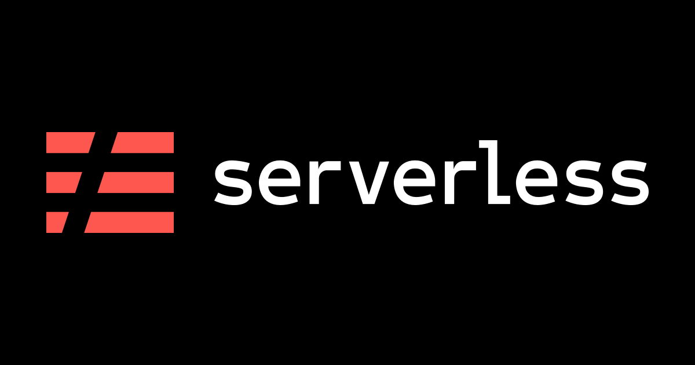
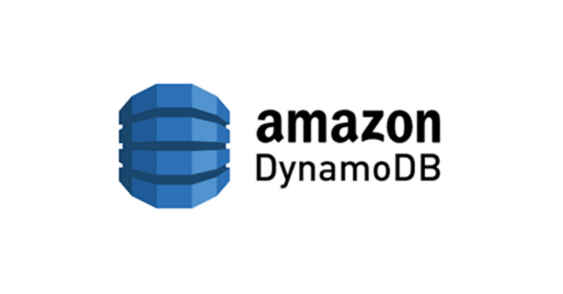

[](https://dl.circleci.com/status-badge/redirect/gh/Elshafeay/toplegal-assignment/tree/main) 
[](https://codecov.io/gh/Elshafeay/toplegal-assignment)

<p align="center">
  
  
</p>

# Top.Legal Serverless Backend Assessment

## Table of Contents

* [Description](#Description)
* [Prerequisites](#Prerequisites)
* [Instructions](#Instructions)
* [Documentation](#Documentation)
* [Areas of Improvement](#Improvement)

## Description

This is a mini Typescript project that manages contracts.
It features the use of [**Serverless-Offline**](https://www.npmjs.com/package/serverless-offline), [**DynamoDB-Local**](https://www.npmjs.com/package/serverless-dynamodb-local), [**Jest**](https://www.npmjs.com/package/jest), [**Winston**](https://www.npmjs.com/package/winston), [**Morgan**](https://www.npmjs.com/package/morgan), [**Joi**](https://www.npmjs.com/package/joi), and [**Eslint**](https://www.npmjs.com/package/joi).

## Prerequisites
Your machine must have the following installed on it:
- [Node/NPM](https://nodejs.org/en/download/) (v14 or higher)
- [Docker](https://docs.docker.com/get-docker/) && [docker-compose](https://docs.docker.com/compose/install/)

## Instructions

After Cloning the Project, head to the project directory and follow the below steps

### 1. Create the needed databases
You can do so by running:
```
docker-compose up
```
This will create two databases for you, one for development and another one for testing.

> You might get a permission error in the docker container log, if docker doesn't have access to modify the current directory (we do it to make the data persistent).
In this case, all you need to do is to run this command in the project directory `sudo chmod 777 dynamodb-data`.

### 2. Install the needed dependencies
Now go a head and install the needed dependencies by running:
```
npm install
```

After the installation is finished, we need to make sure serverless is installed successfully, so let's try
```
sls -v
```

if the version shows up, then everything is fine, otherwise you will need to run:
```
npm i -g serverless serverless-dynamodb-local
```

### 3. DB Creation and Migrations
Now, that everything is working fine by now, let's run our migration using
``` 
npm run migrate
```

### 4. Starting the project
Simply run
```
npm start
```

Any by now you should be able to go to `localhost:3000` to test that everything is working as expected.

### 5. Running the tests
To run the project test suites, we can simply use
```
npm test
```


## Documentaion
- There's a postman collection within the repo `docs/TopLegal.postman_collection.json` than can help you navigate the endpoints.
- The only endpoints that requires authentication are:
  - `GET /me`
  - `GET /users/`
  - `GET /users/{id}`

## Areas of Improvement <a name="Improvement"></a>
- To make a general configuration that works both locally and on the cloud.